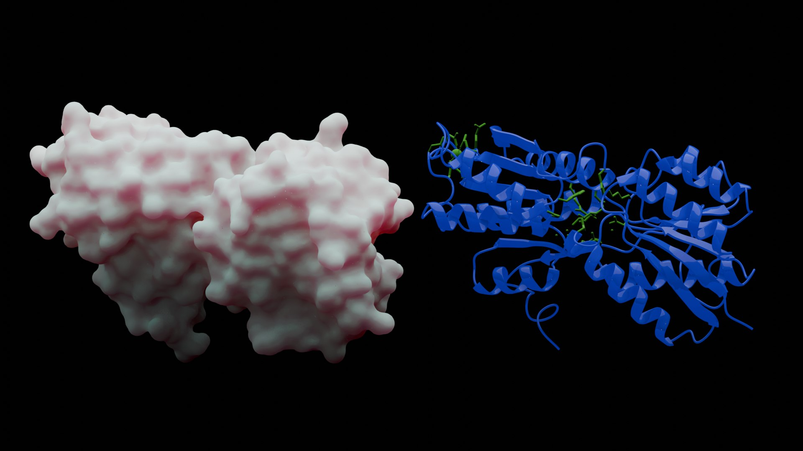

# Computational Biology Portfolio

[Visit the live portfolio](https://riccaran.github.io/main/)

A lightweight, responsive portfolio presenting selected work in computational biology, bioinformatics, structural analysis, network science, and scientific machine learning.

## Highlights

- Evidence-led project case studies using outputs from the public repositories
- Project filters for network, structure, and computational-method work
- Responsive navigation and layouts for desktop, tablet, and mobile
- Accessible interactions, reduced-motion support, and semantic page structure
- Local optimized images and dependency-free interface JavaScript

## Structure

- `index.html` contains the page content and metadata
- `styles.css` defines the visual system and responsive layouts
- `script.js` handles navigation, filters, progress, and contact interactions
- `assets/` contains optimized project imagery and the favicon

The site is published as a static GitHub Pages project from the `main` branch.
